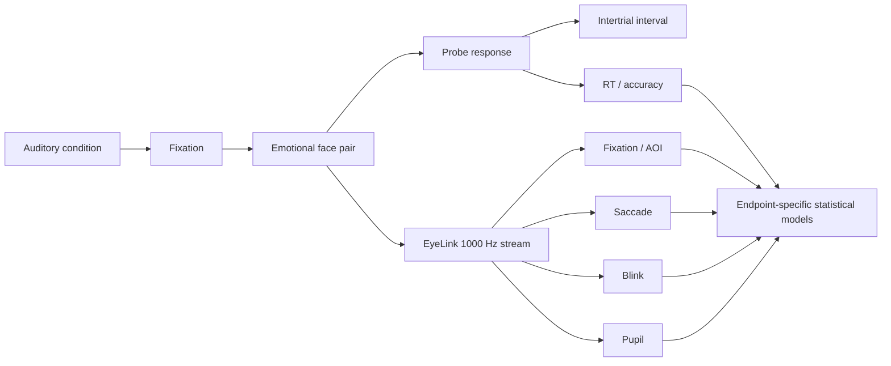

# Experimental System Design

```mermaid
flowchart LR
    A[Auditory condition] --> B[Fixation]
    B --> C[Emotional face pair]
    C --> D[Probe response]
    D --> E[Intertrial interval]
    C --> G[EyeLink 1000 Hz stream]
    G --> H[Fixation / AOI]
    G --> I[Saccade]
    G --> J[Blink]
    G --> K[Pupil]
    D --> L[RT / accuracy]
    H --> M[Endpoint-specific statistical models]
    I --> M
    J --> M
    K --> M
    L --> M
```

A sanitized trial-architecture figure is included in `assets/eye_tracking_trial_architecture.png` and contains no licensed face stimuli.
